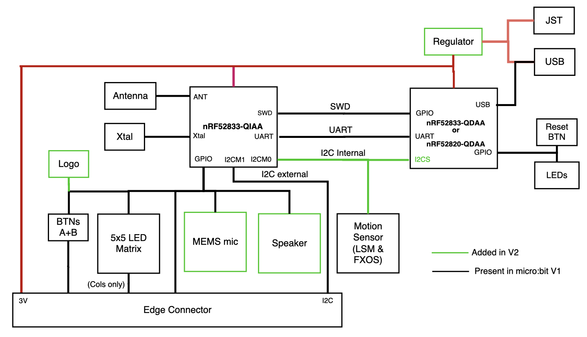

# 🚦 Smart City Micro:bit Project

This project simulates a basic **Smart City** setup using Micro:bit devices for **smart lamps** and **automatic gates**, all communicating via radio signals. A mobile unit (e.g., a "car") sends a signal that nearby devices react to automatically.

## 📁 Project Structure

- `car.py` – Sends a broadcast signal (`"on"`) to nearby devices.
- `lamps.py` – Turns on streetlamps when a car is nearby.
- `barrier.py` – Opens gates when a car approaches and closes them after a short delay.
- `hex/` – Precompiled `.hex` files for each device (optional).

---

## How It Works
- The decision to use radio communication was made based on the current hardware capabilities. Since Micro:bit v1 only allows one Bluetooth connection pairing—and while active, that disables the radio—we opted for the RSSI implementation using one Micro:bit as the broadcasting antenna in the car.

- In laboratory settings, implementing an identification protocol for enhanced security would introduce additional complexity and could increase detection discrepancies over short distances, particularly given that the antennas in use are not optimal.

### Car Micro:bit

- Continuously sends the message `"on"` over the radio.
- Devices listening on the same radio group will react if the signal is strong enough.
- **Radio Group:** `7`
- **Transmit Power:** `7` (maximum strength, default comes as 6)

### Lamp Micro:bit

- Listens for `"on"` messages on **radio group 7**.
- If the message is received with **RSSI > -50 dBm**, the lamp turns **on**.
- Lamp stays on for **2 seconds**, then turns off automatically.
- Broadcasts its ID (e.g., `L01`) periodically to indicate it's active. (deprecated)
- THE Lamp has a luminosity sensor.

### Gate Micro:bit

- Also listens for `"on"` messages.
- If the signal is strong enough and the gate is currently closed:
  - It opens the gate (servo to `0°`).
  - Waits 2 seconds.
  - Closes the gate again (servo to `90°`).
- Visual icons show the current gate state on the LED display.

---

## 💻 How to Upload the Code

### Option 1: Use Microsoft MakeCode (Recommended for Editing)

1. Go to [MakeCode for Micro:bit](https://makecode.microbit.org/).
2. Click on **"New Project"**.
3. Copy and paste the contents of the appropriate `.py` file (`car_code.py`, `lamps_code.py`, or `gate_code.py`) into the Python editor.
4. Modify any values you need (e.g., `lamp_id`, `rssi_thr`).
5. Click on **Download** to get the `.hex` file.
6. Connect your Micro:bit via USB.
7. Drag and drop the `.hex` file onto the MICROBIT drive that appears on your computer.

### Option 2: Use Precompiled HEX Files

1. Open the `hex/` folder in this repository.
2. Choose the corresponding `.hex` file (e.g., `car.hex`, `lamp.hex`, `gate.hex`).
3. Connect your Micro:bit via USB.
4. Drag and drop the file to the MICROBIT drive.

---

## ⚙️ Customization Tips

- Change the **radio group** (`radio.set_group(7)`) if you want to run multiple setups independently.
- Adjust the **RSSI threshold** (`rssi_thr = -45`) to control how close a car must be for a response.
- Use different **lamp IDs** (`lamp_id = "01"`) to identify each device in logs or future expansions.

---

## 🛠 Hardware Required

- 3x Micro:bit boards
- 1x Servo motor (for gate)
- LED (optional, for lamp simulation)
- USB cables for uploading and power
- Battery packs (for mobile use)

---

## 📸 Visual Indicators

- **Lamp Off:** Square border on LED matrix
- **Lamp On:** All LEDs lit
- **Gate Closed:** Standard door icon
- **Gate Open:** Arrow pointing up (gate lifting)

### Access Gate

### Lamp

### Micro:bit Legend

### Micro:bit Setup

---

## 🧪 Future Improvements

- Add remote management or scheduling
- Implement encryption or pairing for secure communication

---

